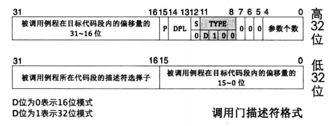
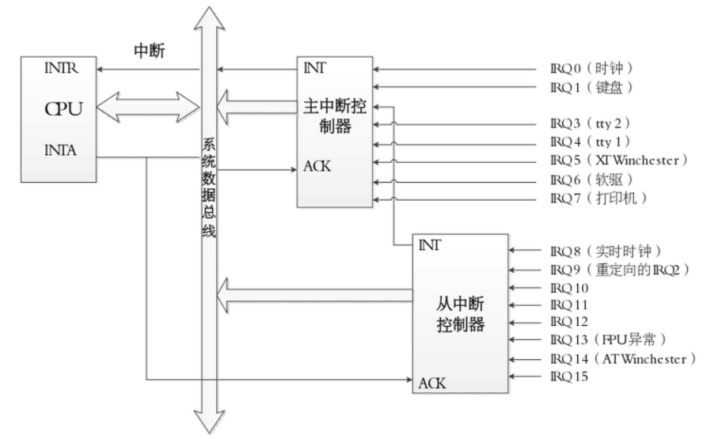

# 使用C/C++实现一个操作系统

# chapter 04 异常和中断

## 4.1 中断描述符表

系统中可能的每种类型的异常都分配了一个唯一的非负整数的异常号。一些号码由处理器的设计者分配，如除0、缺页、内存访问违例、断点、算术运算溢出。其它号码由操作系统内核的设计者分配：系统调用、来自外部I/O设备的信号。

异常号是异常表中的索引，异常表的起始地址放在 异常表基址寄存器(exception table base register) 的特殊CPU寄存器里。

中断描述符表(Interrupt Descriptor Table, IDT)是保护模式下用于存储中断处理程序入口的表。表中所有描述符都记录一段程序的起始地址，是通向某段程序的“门”，因此中断描述符表中的描述符被称为“门”。

所有的描述符大小都是8字节，门描述符和段描述符类似。各种门都属于系统段，有4种门描述符：

1. 任务门

    任务门和任务状态段(Task Status Segment, TSS)是Intel处理器在硬件一级提供的任务切换机制。任务门需要和TSS配合使用，在任务门中记录TSS选择子，偏移量未使用。任务门可以存在于GDT，LDT和IDT中，但大多数操作系统都未用TSS实现任务切换。

    

2. 中断门

    中断门包含了中断处理程序所在段的段选择子和段内偏移地址。通过此方式进入中断后，标志寄存器`eflags`中的`IF`位自动置0，即自动关闭中断，避免中断嵌套。中断门只允许存在于IDT中。

    


3. 陷阱门

    和中断门类似，但由陷阱门引发异常后，`IF`位不会置0。陷阱门只允许存在于IDT中。

    

4. 调用门

    调用门提供给用户进程进入特权0级的方式，DPL为3。调用门记录例程的地址，只能用`call`和`jmp`指令调用。调用门可以安装在GDT和LDT中。

    

现代操作系统很少用到调用门和任务门。

门描述符的结构定义为
``` cpp
struct GateDescriptor
{
    uint16_t lowbits;
    uint16_t segmentSelector;
    uint8_t reserved;
    uint8_t access;
    uint16_t highbits;
} __attribute__((packed));
```

一个中断源就会产生一个中断向量，一个中断向量对应IDT中的一个门描述符，通过门描述符可以找到对应的中断处理程序。

CPU内部有个中断描述符表寄存器(Interrupt Descriptor Table Register, IDTR)，中断描述符表地址加载到IDTR中。IDTR寄存器的结构如下图。

|32位Base(16~47)|16位Limit(0~15)|
|-|-|

GDT中的第0个描述符不可用，但IDT无此限制。16位Limit可容纳描述符的个数是8192个，但处理器只支持256个中断，剩下的描述符不可用。

## 4.2 中断处理过程及保护

1. 处理器根据中断向量号定位中断门描述符

2. 处理器进行特权级检查

    中断向量号是个整数，其中并没有请求特权等级(Request Privilege Level, RPL)，在对由中断引起的特权级转移做特权级检查中不涉及RPL。对于软中断，当前特权级CPL必须在门描述符DPL和门中目标代码段DPL之间，这是为了防止位于3特权级的用户程序主动调用某些只为内核服务的例程。

3. 执行中断处理程序


门描述符中保存的是中断处理程序所在代码段的选择子及段内偏移量。处理器加载选择子到代码段寄存器`CS`，加载偏移量到指令指针寄存器`EIP`。当前进程被中断打断后，处理器自动把`CS`和`EIP`保存到中断处理程序使用的栈中。还要保存`EFLAGS`。不同特权级下处理器使用不同的栈，如果特权级变化，还要压入`SS`和`ESP`寄存器。

1. 处理器根据中断向量号找到中断描述符，若CPL权限比DPL低，则将`SS`和`ESP`压栈；
2. 压入`EFLAGS`寄存器；
3. 切换目标代码段，将`CS`和`EIP`保存到栈中备份；
4. 某些异常会有错误码，错误码包含选择子等信息，会随`EIP`之后入栈，记作`ERROR_CODE`。

在使用`iret`返回前，要保证栈顶往上的顺序是正确的。


错误码本质上是个描述符选择子，通过低3位属性来修饰此选择子指向哪个表中的哪个描述符。如果错误码全为0，表示中断的发生与特定的段无关。

## 4.3 定义外部中断和异常

我们要实现许多中断，比较好的方法是创建一个管理类`InterruptManager`管理所有的中断。

使用函数`handleInterrupts()`处理中断，每个中断用一个中断向量号标识，它将作为函数的第一个参数。由于这个函数需要在程序运行期间一直存在，且不是被某个InterruptManager对象所调用的，需要作为类的静态方法。

中断发生时，处理器会将某些数据压入堆栈，我们需要在中断处理完毕后返回堆栈的原有位置继续运行，因此在进入中断时还要传入当前的栈指针`esp`作为第二个参数，并且在函数返回时返回`esp`。

``` cpp
// os/interrupts.h
class InterruptManager
{
public:
    static uint32_t handleInterrupt(uint8_t interruptNumber, uint32_t esp);
}；


```

在`handleInterrupt()`中用`printf()`打印一句话作为中断发生的标志。`printf()`是外部函数，使用前需要进行声明。

``` cpp
// os/interrupts.cpp
#include "interrupts.h"

void printf(const char*);
uint32_t InterruptManager::handleInterrupt(uint8_t interruptNumber, uint32_t esp) 
{ 
    printf("interrupt");
    return esp; 
}
```

使用反汇编工具可以查找到它的汇编代码中的名字为`__ZN16InterruptManager15handleInterruptEhj`。

建立汇编文件`asm_interrupts.s`，加上asm前缀是为了生成.o文件时与.cpp生成的.o文件区分开。在汇编文件中我们声明一个代码段，在代码段中声明外部函数`handleInterrupt()`。接下来在`int_bottom`函数中执行一些压栈操作，最后压入函数的两个参数并调用。

调用完毕后，进行出栈操作，它与入栈操作一一对应。恢复现场完毕后，使用iret指令返回。

``` s
# os/asm_interrupts.s
.section .text
.extern __ZN16InterruptManager15handleInterruptEhj

int_bottom:
    pushl %ebp
    pushl %edi
    pushl %esi
    pushl %edx
    pushl %ecx
    pushl %ebx
    pushl %eax  # 将通用寄存器压栈

    pushl %esp  # 压入栈指针
    push (interruptnumber)  # 压入中断向量号
    # 此时需要中断向量号，因此在下面的数据段中声明并初始化
    call __ZN16InterruptManager15handleInterruptEhj

    # 将函数返回值作为esp
    movl %eax, %esp
    # 恢复现场
    popl %eax
    popl %ebx
    popl %ecx
    popl %edx
    popl %esi
    popl %edi
    popl %ebp

    add $5, %esp

    iret

.data
    interruptnumber: .byte 0    # byte类型，初始化为0
```

接下来需要定义intel设计者设计的17个中断和20个异常的服务例程。作为中断服务例程，它们也是静态成员函数。产生中断时，将调用相应的中断服务例程，并在这些中断服务例程中统一执行`handleInterrput()`作为一个初始的中断实现。

``` cpp
// os/interrupts.cpp
class InterruptManager
{
private:
    static uint32_t handleInterrupt(uint8_t interruptNumber, uint32_t esp);

    static void HandleInterruptRequest0x00();
    static void HandleInterruptRequest0x01();
    static void HandleInterruptRequest0x02();
    static void HandleInterruptRequest0x03();
    static void HandleInterruptRequest0x04();
    static void HandleInterruptRequest0x05();
    static void HandleInterruptRequest0x06();
    static void HandleInterruptRequest0x07();
    static void HandleInterruptRequest0x08();
    static void HandleInterruptRequest0x09();
    static void HandleInterruptRequest0x0A();
    static void HandleInterruptRequest0x0B();
    static void HandleInterruptRequest0x0C();
    static void HandleInterruptRequest0x0D();
    static void HandleInterruptRequest0x0E();
    static void HandleInterruptRequest0x0F();
    static void HandleInterruptRequest0x31();

    static void HandleException0x00();
    static void HandleException0x01();
    static void HandleException0x02();
    static void HandleException0x03();
    static void HandleException0x04();
    static void HandleException0x05();
    static void HandleException0x06();
    static void HandleException0x07();
    static void HandleException0x08();
    static void HandleException0x09();
    static void HandleException0x0A();
    static void HandleException0x0B();
    static void HandleException0x0C();
    static void HandleException0x0D();
    static void HandleException0x0E();
    static void HandleException0x0F();
    static void HandleException0x10();
    static void HandleException0x11();
    static void HandleException0x12();
    static void HandleException0x13();
};
```

在汇编文件asm_interrupts.s中要实现它们的定义。为了简化书写，使用汇编的宏替换。在宏中，定义了这些中断服务例程的操作是确定中断号，并赋值给`interruptnumber`作为后面`handleInterrupt()`的参数使用。执行中断服务例程后，将跳转到中断处理程序`.int_bottom`中，进而在`.int_bottom`中执行`handleInterrupt()`。为方便展示调用关系，使用C++格式的伪代码：
``` cpp
InterruptManager::HandleInterruptRequest0x00();

InterruptManager::HandleInterruptRequest0x00()
{
    .int_bottom();
}

.int_bottom()
{
    handleInterrupt();
}
```

同样需要通过反汇编查询这些函数在汇编代码中的名字，并修改汇编文件asm_interrupts.s。注意，外部中断的中断向量号从20开始，然而在函数命名时我们从0开始命名，传入中断向量号时需要加上一个20的偏移量，设为`IRQ_BASE`。
``` s
# os/asm_interrupts.s
.set IRQ_BASE, 0x20
.section .text
.extern __ZN16InterruptManager15handleInterruptEhj

.macro HandleInterruptRequest num
.global __ZN16InterruptManager26HandleInterruptRequest\num\()Ev
__ZN16InterruptManager26HandleInterruptRequest\num\()Ev:
    movb $\num + IRQ_BASE, (interruptnumber)
    pushl $0     # 这一步是为了将错误码压栈
    jmp int_bottom
.endm

.macro HandleException num
.global __ZN16InterruptManager19HandleException\num\()Ev
__ZN16InterruptManager19HandleException\num\()Ev:
    movb $\num, (interruptnumber)
    jmp int_bottom
.endm

# 定义外部中断
HandleInterruptRequest 0x00
HandleInterruptRequest 0x01
HandleInterruptRequest 0x02
HandleInterruptRequest 0x03
HandleInterruptRequest 0x04
HandleInterruptRequest 0x05
HandleInterruptRequest 0x06
HandleInterruptRequest 0x07
HandleInterruptRequest 0x08
HandleInterruptRequest 0x09
HandleInterruptRequest 0x0A
HandleInterruptRequest 0x0B
HandleInterruptRequest 0x0C
HandleInterruptRequest 0x0D
HandleInterruptRequest 0x0E
HandleInterruptRequest 0x0F
HandleInterruptRequest 0x31

# 定义异常
HandleException 0x00
HandleException 0x01
HandleException 0x02
HandleException 0x03
HandleException 0x04
HandleException 0x05
HandleException 0x06
HandleException 0x07
HandleException 0x08
HandleException 0x09
HandleException 0x0A
HandleException 0x0B
HandleException 0x0C
HandleException 0x0D
HandleException 0x0E
HandleException 0x0F
HandleException 0x10
HandleException 0x11
HandleException 0x12
HandleException 0x13

.int_bottom:
# ...

.data
# ...
```

同时我们也需要将这个20的偏移量记录在类`InterruptManager`中。这个偏移量在构造函数中设置。

``` cpp
// os/interrupts.h
class InterruptManager
{
private:
    // ...
    uint16_t hardwareInterruptOffset;
};
```

到此为止，我们定义了外部中断和异常的服务例程。接下来是实现从中断向量号查找到这些服务例程的地址的过程。

## 4.4 定义IDT

为了得到中断服务例程的入口地址，中断向量号将作为IDT的索引查找中断描述符。

中断描述符具有下面的形式，按照从低位到高位排列，并禁用编译器的内存对齐。
``` cpp
struct GateDescriptor
{
    uint16_t lowbits;
    uint16_t codeSegmentSelector;
    uint8_t reserved;
    uint8_t access;
    uint16_t highbits;
} __attribute__((packed));
```
它是`InterruptManager`的私有成员。中断描述符表可看做是中断门描述符的数组，用`IDT`表示，大小为256。它也是一个静态变量。

它的构造函数中需要传入以下信息：中断向量号、中断服务例程所在的代码段选择子、中断服务例程的入口地址、特权级DPL、描述符类型type。

``` cpp
// os/interrupts.cpp
class InterruptManager
{
private:
    struct GateDescriptor
    {
        // ...
    } __attribute__((packed));

    static void setGateDescriptor(uint8_t interruptNumber, uint16_t codeSegmentSelector, void (*handle)(), uint8_t DPL, uint8_t type);

    static GateDescriptor IDT[256];

private:
    static uint32_t handleInterrupt(uint8_t interruptNumber, uint32_t esp);

    static void HandleInterruptRequest0x00();
    // ...
    static void HandleException0x13();
```

在`InterruptManager`类的构造函数中，需要传入全局描述符表`gdt`。
``` cpp
// os/interrupts.h
class InterruptManager
{
public:
    InterruptManager(uint16_t hardwareInterruptOffset_, GlobalDescriptorTable *gdt);
    ~InterruptManager();

private:
// ...
};
```

接下来是在.cpp文件中实现上面的方法。
``` cpp
// os/interrupts.cpp
#include "interrupts.h"

void printf(const char*);
uint32_t InterruptManager::handleInterrupt(uint8_t interruptNumber, uint32_t esp) 
{ 
    // ...
}

// 静态变量IDT在头文件中声明，在.cpp文件中定义
InterruptManager::GateDescriptor InterruptManager::IDT[256];

// 按位设置门描述符
void InterruptManager::setGateDescriptor(uint8_t interruptNumber, uint16_t codeSegmentSelector_, void (*handle)(), uint8_t DPL, uint8_t type)
{
    IDT[interruptNumber].lowbits = ((uint32_t)handle) & 0xffff;
    IDT[interruptNumber].highbits = ((uint32_t)handle >> 16) & 0xffff;
    IDT[interruptNumber].codeSegmentSelector = codeSegmentSelector_;
    IDT[interruptNumber].access = 0x80 | ((DPL & 3) << 5) | type;
    IDT[interruptNumber].reserved = 0;
}
```

`InterruptManager`的构造函数比较复杂，首先需要由代码段选择子得到段偏移，方式如下
``` cpp
uint16_t codeSegment = (gdt->getCodeSegmentSelector()) << 3;
```
接着需要初始化256个异常。
``` cpp
for (uint16_t i = 0; i < 256; i++)
{
    setGateDescriptor(i, codeSegment, &interruptIgnore, 0, __IDT_INTERRUPT_GATE_TYPE_);
}
```
其中中断服务例程的入口地址暂时设为`&interruptIgnore`。它是一个地址的标识符，我们在头文件中声明它，并不需要定义。
``` cpp
// os/interrupts.h
class InterruptManager
{
private:
    static void interruptIgnore();
    // ...
};
```

但是对于我们已经定义过的17个外部中断和20个异常，我们需要重新给定它们的中断服务例程的入口地址。为方便书写，采用C++宏替换。

``` cpp
// os/interrupts.cpp
#include "interrupts.h"

void printf(const char*);
uint32_t InterruptManager::handleInterrupt(uint8_t interruptNumber, uint32_t esp) 
{ 
    // ...
}

InterruptManager::GateDescriptor InterruptManager::IDT[256];

void InterruptManager::setGateDescriptor(uint8_t interruptNumber, uint16_t codeSegmentSelector_, void (*handle)(), uint8_t DPL, uint8_t type)
{
    // ...
}

InterruptManager::InterruptManager(uint16_t hardwareInterruptOffset_, GlobalDescriptorTable *gdt) : priCommand(0x20), priData(0x21), semiCommand(0xA0), semiData(0xA1)
{
    hardwareInterruptOffset = hardwareInterruptOffset_;
    hardwareInterruptOffset = hardwareInterruptOffset_;
    const uint8_t __IDT_INTERRUPT_GATE_TYPE_ = 0xe;
    uint16_t codeSegment = (gdt->getCodeSegmentSelector()) << 3;

    for (uint16_t i = 0; i < 256; i++)
    {
        setGateDescriptor(i, codeSegment, &interruptIgnore, 0, __IDT_INTERRUPT_GATE_TYPE_);
    }

#define XX(name) \
    setGateDescriptor(0x##name, codeSegment, &HandleException0x##name, \
                      0, __IDT_INTERRUPT_GATE_TYPE_)

    XX(00);
    XX(01);
    XX(02);
    XX(03);
    XX(04);
    XX(05);
    XX(06);
    XX(07);
    XX(08);
    XX(09);
    XX(0A);
    XX(0B);
    XX(0C);
    XX(0D);
    XX(0E);
    XX(0F);
    XX(10);
    XX(11);
    XX(12);
    XX(13);
#undef XX

#define XX(name) \
    setGateDescriptor(hardwareInterruptOffset + 0x##name, codeSegment, \
                      &HandleInterruptRequest0x##name, \
                      0, __IDT_INTERRUPT_GATE_TYPE_)

    XX(00);
    XX(01);
    XX(02);
    XX(03);
    XX(04);
    XX(05);
    XX(06);
    XX(07);
    XX(08);
    XX(09);
    XX(0A);
    XX(0B);
    XX(0C);
    XX(0D);
    XX(0E);
    XX(0F);
    XX(31);
#undef XX
```

和GDT一样，IDT的地址也放在一个特殊的寄存器`idtr`中，使用`lidt`指令进行装载。我们在类中创建一个符合这个寄存器结构的结构体。它的结构和装载GDT的寄存器类似。
``` cpp
// os/interrupts.h
class InterruptManager
{
public:
    // ...

private:
    struct InterruptDescriptorTablePointer
    {
        uint16_t limit;
        uint32_t base;
    } __attribute__((packed));
    // ...
};
```
在构造函数中创建这个结构体，设置好合适的值后采用内联汇编将IDT的地址加载到idtr中。
``` cpp
InterruptManager::InterruptManager(uint16_t hardwareInterruptOffset_, GlobalDescriptorTable *gdt) : priCommand(0x20), priData(0x21), semiCommand(0xA0), semiData(0xA1)
{
    hardwareInterruptOffset = hardwareInterruptOffset_;
    hardwareInterruptOffset = hardwareInterruptOffset_;
    const uint8_t __IDT_INTERRUPT_GATE_TYPE_ = 0xe;
    uint16_t codeSegment = (gdt->getCodeSegmentSelector()) << 3;

    for (uint16_t i = 0; i < 256; i++)
    {
        setGateDescriptor(i, codeSegment, &interruptIgnore, 0, __IDT_INTERRUPT_GATE_TYPE_);
    }
#define XX
// ...
#undef XX

    InterruptDescriptorTablePointer idtr;
    idtr.limit = 256 * sizeof(GateDescriptor) - 1;
    idtr.base = (uint32_t)IDT;

    asm volatile("lidt %0"
                 :
                 : "m"(idtr));
}

// 顺便增加析构函数
InterruptManager::~InterruptManager() {}
```

CPU开启中断也需要一个特殊的指令`sti`，我们用类方法`activate`实现它。
``` cpp
// os/interrupts.h
class InterruptManager
{
public:
    // ...
    void activate();
};
```

``` cpp
// os/interrupts.cpp
// ...
void InterruptManager::activate()
{
    asm volatile("sti");
}
```

## 4.5 修改kernel主函数和中断控制器

在kernel.cpp中引入interrupts，并在主函数`kernelMain`中加入全局描述符表GDT和中断管理类。
``` cpp
#include "interrupts.h"
// ...
void kernelMain(void *multiboot_structure, uint32_t magicnumber)
{
    printf("hello world\n");
    printf("hello myos\n");
    GlobalDescriptorTable gdt;
    InterruptManager interrupts(0x20, &gdt);
    interrupts.activate();
    while (1);
}
// ...
```

下面一块内容与硬件编程相关，中断控制器需要进行一些初始化操作。中断控制器芯片是8259A，一个控制器能够控制8个引脚，最多实现8个中断。



8259A通过两个I/O地址来进行中断相关的数据传送，对于单个的8259A或者是两级级联中的主8259A而言，这两个I/O地址是0x20和0x21。对于两级级联的从8259A而言，这两个I/O地址是0xA0和0xA1。

我们需要在中断管理类中定义这四个端口并初始化。
``` cpp
// os/interrupts.h
#include "port.h"
private:
    Port8BitSlow priCommand;
    Port8BitSlow priData;
    Port8BitSlow semiCommand;
    Port8BitSlow semiData;
    // ...
```
具体的初始化和写入的操作如下。
``` cpp
// os/interrupts.cpp
InterruptManager::InterruptManager(uint16_t hardwareInterruptOffset_, GlobalDescriptorTable *gdt) : priCommand(0x20), priData(0x21), semiCommand(0xA0), semiData(0xA1)
{
    // ...
    priCommand.write(0x11);
    semiCommand.write(0x11);
    priData.write(hardwareInterruptOffset);
    semiData.write(hardwareInterruptOffset + 8);
    priData.write(0x04);
    semiData.write(0x02);
    priData.write(0x01);
    semiData.write(0x01);
    priData.write(0x00);
    semiData.write(0x00);

    InterruptDescriptorTablePointer idtr;
    idtr.limit = 256 * sizeof(GateDescriptor) - 1;
    idtr.base = (uint32_t)IDT;

    asm volatile("lidt %0"
                 :
                 : "m"(idtr));
}
```

在Makefile文件中加入可执行目标asm_interrupts.o和interrupts.o，生成新的镜像文件。在虚拟机中运行，屏幕上首先打印输出
```
hello world
hello myos
```
随后敲击键盘，操作系统发出键盘中断，打印出中断信息
```
interrupt
```

## 4.6 单例模式的InterruptManager

> ? 为什么需要单例模式？

在操作系统中，只存在一个全局的`InterruptManager`，这在C++中使用单例设计模式可以实现。但是由于我们禁用了C++标准库的链接（实际上也不能使用），无法用`new`分配内存，就无法在一个`Singleton`类模板中创建一个新的静态指针`m_instance`，因此采用一个类似的方法，在`InterruptManager`类中创建一个指针`activeInterruptManager`，它指向当前激活的`InterruptManager`实例对象。记住，在实现文件中定义声明过的静态指针。

很显然，它是一个静态指针，并且所有的中断处理请求需要由该实例对象进行处理，如果这个指针不为空的话。处理这种请求的函数应该是一个成员函数。

我们修改`activate`的实现，它应该将静态指针`activeInterruptManager`指向一个正确的`InterruptManager`实例对象，并且将原来的实例中断给关闭，这要求增加一个`deactivate()`关中断函数。

``` cpp
// os/interrupts.cpp
InterruptManager *InterruptManager::activeInterruptManager = nullptr;
// ...
void InterruptManager::activate()
{
    if (activeInterruptManager != nullptr)
    {
        activeInterruptManager->deactivate();
    }
    activeInterruptManager = this;
    asm volatile("sti");
}

void InterruptManager::deactivate()
{
    if (activeInterruptManager == this)
    {
        activeInterruptManager = nullptr;
        asm volatile("cli");
    }
}
```

上面提到成员函数处理中断，这个成员函数命名为`handleInt()`。由静态指针指向的实例来调用这个函数作为中断处理，还需要修改之前定义的静态中断处理函数`handleInterrupt()`。

另一个问题是在硬件中断处理结束后，需要对硬件端口写入一些特定值来告知硬件中断处理已经完成。这部分应写在`handleInt()`中。

注意到，我们对时钟中断不进行打印`interrupt`字符串的操作。
``` cpp
// os/interrupts.cpp
uint32_t InterruptManager::handleInterrupt(uint8_t interruptNumber, uint32_t esp) 
{ 
    if (activeInterruptManager)
    {
        return activeInterruptManager->handleInt(interruptNumber, esp);
    }
    return esp;
}
// ...
uint32_t InterruptManager::handleInt(uint8_t interruptNumber, uint32_t esp)
{
    if (interruptNumber != hardwareInterruptOffset)
    {
        printf("interrupt");
    }
    if (interruptNumber >= hardwareInterruptOffset && interruptNumber < hardwareInterruptOffset + 16)
    {
        priCommand.write(0x20);
        if (interruptNumber >= hardwareInterruptOffset + 8)
        {
            semiCommand.write(0x20);
        }
    }
    return esp; 
}
```

这样一来，先前在4.3节提到的调用关系就又多了一层。
``` cpp
InterruptManager::HandleInterruptRequest0x00();

InterruptManager::HandleInterruptRequest0x00()
{
    .int_bottom();
}

.int_bottom()
{
    handleInterrupt();
}

handleInterrupt()
{
    activeInterruptManager->handleInt();
}
```

这就完成了单例模式的设计，保证同时最多只有一个`InterruptManager`实例对象在处理中断请求。这个实例是在`kernelMain`中定义的，由于在之前没有定义过实例，此时的静态指针为空指针，程序将把调用`activate`函数的实例赋给该静态指针，更新IDT为最新定义的对象的IDT（这在构造函数中就完成了）。发生中断时，操作系统找到了IDT中断服务例程的入口地址，从而调用相应的处理函数。在虚拟机中运行操作系统，仍然能够得到与之前相同的结果。

## 4.7 定义异常基类

我们之后会定义各种类型的中断，包括鼠标、键盘等中断。之前的中断处理很简单，仅仅是打印了一行输出，下面将实现对所有256个中断的中断服务例程。

首先定义一个中断服务例程的基类`InterruptRoutine`，并需要在`InterruptManager`中包含256个中断服务例程，将它们存放在数组`routine`中。由于在定义之前需要使用`InterruptRoutine`的数组，需要做前置声明。

每定义一个`InterruptRoutine`，就需要将它加入中断管理实例的中断服务例程的数组中，它要访问`InterruptManager`的私有成员，需要作为友元类。每一个中断服务例程类对应一个中断服务例程。

``` cpp
// os/interrupt.h
class InterruptRoutine;

class InterruptManager
{
    friend class InterruptRoutine;
public:
    // ...
private:
    InterruptRoutine* routines[256];
}

class InterruptRoutine
{
public:
    uint32_t routine(uint32_t esp);

protected:
    InterruptRoutine(uint8_t interruptNumber, InterruptManager* interruptManager);
    ~InterruptRoutine();

    uint8_t interruptNumber;
    InterruptManager* interruptManager;
};
```

在实现文件中，需要在`InterruptManager`的构造函数中对256个中断服务例程初始化，设置为空指针。

构造`InterruptRoutine`类时，需要将对应的`InterruptManager`类中的中断服务例程数组的相应元素设置成服务例程类的中断服务例程函数。析构函数被调用时，意味着这个服务例程被销毁，`InterruptManager`对应的服务例程也应修改为空指针。

``` cpp
InterruptManager::InterruptManager(uint16_t hardwareInterruptOffset_, GlobalDescriptorTable *gdt) : priCommand(0x20), priData(0x21), semiCommand(0xA0), semiData(0xA1)
{
    // ...
    for (uint16_t i = 0; i < 256; i++)
    {
        routines[i] = nullptr;
        setGateDescriptor(i, codeSegment, &interruptIgnore, 0, __IDT_INTERRUPT_GATE_TYPE_);
    }
    // ...
}

InterruptRoutine::InterruptRoutine(uint8_t interruptNumber_, InterruptManager* interruptManager_) 
{
    interruptNumber = interruptNumber_;
    interruptManager = interruptManager_;
    interruptManager->routines[interruptNumber] = this;
}

InterruptRoutine::~InterruptRoutine() 
{
    if (interruptManager->routines[interruptNumber] == this) 
    {
        interruptManager->routines[interruptNumber] = nullptr;
    }
}
```

我们每定义一个中断服务例程类，就应当优先使用我们定义的这个类，而不能再简单地打印一串`interrupt`字符作为处理。我们还希望对于那些没有写中断服务例程的中断，在打印字符串的同时也能打印中断号，但是我们的`printf()`函数是不完善的，需要投机取巧一阵子，作字符替换。
``` cpp
uint32_t InterruptManager::handleInt(uint8_t interruptNumber, uint32_t esp)
{
    if (routines[interruptNumber])
    {
        esp = routines[interruptNumber]->routine(esp);
    }
    else if (interruptNumber != hardwareInterruptOffset)
    {
        char *msg = "unprocessed interrupt 0x00\n";
        const char *hex = "0123456789ABCDEF";
        msg[22] = hex[(interruptNumber >> 4) & 0x0f];
        msg[23] = hex[interruptNumber & 0x0f];
        printf(msg);
    }
    if (interruptNumber >= hardwareInterruptOffset && interruptNumber < hardwareInterruptOffset + 16)
    {
        // ...
    }
    return esp; 
}
```

现在我们在虚拟机上运行，随意敲击键盘按键，就可以看到中断号了。下一步的任务是编写键盘、鼠标等中断服务例程和它们的驱动程序。