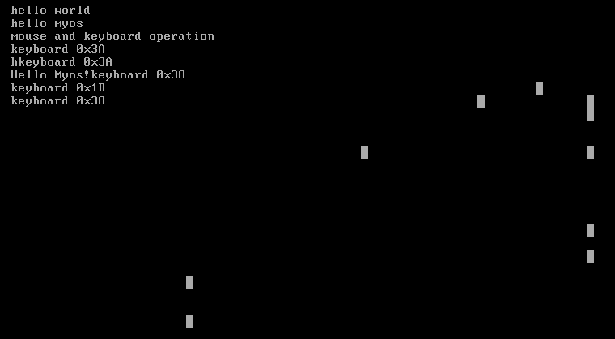

# 使用C/C++实现一个操作系统

# chapter 05 键盘操作和鼠标操作

## 5.1 键盘操作

按照上一章的路线，我们将实现键盘操作。

实现键盘操作的核心是编写键盘驱动`KeyboardDriver`，它是一个`InterruptRoutine`的子类，对应了键盘操作的中断服务例程。

类中的核心方法是`routine`，它是中断服务例程的定义。

和键盘相关的最重要的硬件是两个芯片。一个是 intel 8042 芯片，位于主板上，CPU 通过 I/O 端口直接和这个芯片通信，获得按键的扫描码或者发送各种键盘命令。另一个是 intel 8048 芯片或者其兼容芯片，位于键盘中，这个芯片主要作用是从键盘的硬件中得到被按的键所产生的扫描码，与 8042 通信，控制键盘本身。8042有两个端口，驱动中`0x60`叫数据端口，`0x64`命令端口。

``` cpp
// os/keyboard.h
#ifndef __KEYBOARD_H__
#define __KEYBOARD_H__

#include "types.h"
#include "interrupts.h"
#include "port.h"

class KeyboardDriver : public InterruptRoutine
{
public:
    KeyboardDriver(InterruptManager *manager);
    ~KeyboardDriver();

    virtual uint32_t routine(uint32_t esp) override;

private:
    Port8Bit dataPort;
    Port8Bit commandPort;
};

#endif
```

> 正常来说，`InterruptRoutine`应该定义为抽象类，而`KeyboardDriver`作为派生类必须具有虚析构函数，但是当前虚函数表、new和delete运算符的功能还未实现，并不能支持C++的这些特性，因此部分资源还不能正确释放。至少现在可以使用的特性包括了继承和弱化版的多态（我们已经使用了`virtual`和`override`关键字）。

首先实现构造函数和析构函数。构造函数涉及到了键盘的硬件编程。

我们将实现键盘的中断服务例程，在列表初始化中需要构造基类对象，并初始化键盘控制芯片的端口。键盘的中断向量号为0x21，命令端口和数据端口已经提到。

这里是[键盘端口](https://www.win.tue.nl/~aeb/linux/kbd/scancodes-11.html#ss11.1)的详尽描述。

``` cpp
// os/keyboard.cpp
#include "keyboard.h"

KeyboardDriver::KeyboardDriver(InterruptManager *manager)
    : InterruptRoutine(0x01 + manager->getOffset(), manager),
      dataPort(0x60),
      commandPort(0x64)
{
    // 如果commandPort的最低位是1，则清除输出缓冲区
    while (commandPort.read() & 0x1)
    {
        dataPort.read();
    }
    // 开启键盘
    commandPort.write(0xae);
    // 准备读取commandPort
    commandPort.write(0x20);
    uint8_t status = (dataPort.read() | 0x01) & (~0x10);
    // 准备进行写入操作
    commandPort.write(0x60);
    // 写入status
    dataPort.write(status);
    // 清空键盘输出缓冲区，可以继续扫描输入
    dataPort.write(0xf4);
}

KeyboardDriver::~KeyboardDriver()
{
}
```

键盘的中断服务例程是读取键盘的输入并显示在屏幕上，这需要对每一个按键进行读取判断。当按下`shift`键时，输出大写字母，使用一个变量标记`shift`是否被按下即可。每一个按键都有扫描码和断码。实际上按下一个按键时，扫描码和断码会分别触发一次中断，而我们只需要一次中断来打印一个字符，因此只检测扫描码。

``` cpp
// os/keyboard.cpp
// ...
void printf(const char *);

uint32_t KeyboardDriver::routine(uint32_t esp)
{
    uint8_t key = dataPort.read();

    // press shift to input uppercase letter
    static bool shift = false;
    switch (key)
    {
#define XX(num, upper, lower) \
    case 0x##num:             \
        if (shift)            \
            printf(#upper);   \
        else                  \
            printf(#lower);   \
        break

        XX(02, !, 1);
        XX(03, @, 2);
        XX(04, #, 3);
        XX(05, $, 4);
        XX(06, %, 5);
        XX(07, ^, 6);
        XX(08, &, 7);
        XX(09, *, 8);
        XX(0A, (, 9);
        XX(0B, ), 0);

        XX(10, Q, q);
        XX(11, W, w);
        XX(12, E, e);
        XX(13, R, r);
        XX(14, T, t);
        XX(15, Y, y);
        XX(16, U, u);
        XX(17, I, i);
        XX(18, O, o);
        XX(19, P, p);

        XX(1E, A, a);
        XX(1F, S, s);
        XX(20, D, d);
        XX(21, F, f);
        XX(22, G, g);
        XX(23, H, h);
        XX(24, J, j);
        XX(25, K, k);
        XX(26, L, l);

        XX(2C, Y, y);
        XX(2D, X, x);
        XX(2E, C, c);
        XX(2F, V, v);
        XX(30, B, b);
        XX(31, N, n);
        XX(32, M, m);
    case 0x33:
        if (shift)
            printf("<");
        else
            printf(",");
        break;
        XX(34, >, .);
        XX(35, ?, /);
#undef XX

    case 0x1C:
        printf("\n");
        break;
    case 0x39:
        printf(" ");
        break;
    case 0x2A:
    case 0x36:
        shift = true;
        break;
    case 0xAA:
    case 0xB6:
        shift = false;
        break;

    case 0x45:
        break;
    default:
        if (key < 0x80)
        {
            char *msg = (char *)"keyboard 0x00\n";
            const char *hex = "0123456789ABCDEF";
            msg[11] = hex[(key >> 4) & 0x0f];
            msg[12] = hex[key & 0x0f];
            printf(msg);
        }
    }

    return esp;
}
```

## 5.2 鼠标操作

鼠标操作和键盘操作十分类似，这里直接给出头文件代码。

鼠标的私有成员和键盘略有不同，每次读取数据的时候读取的是一个[数据流](https://wiki.osdev.org/Mouse)而不是一个扫描码。它有两种模式，分别是发送3字节流和4字节流，我们使用3字节流，包含的信息见上述维基百科链接。简单来说，它包含了鼠标的位置（后2位）和状态信息（第1位），使用`buffer[3]`存储。然而触发中断时，只能读取一位信息，因此使用`offset`来记录当前读取的是哪一位的信息。除此之外，再使用一个`buttons`变量来记录鼠标当前的状态，如是否是按下状态等等。还有两个变量`x`和`y`用于记录鼠标当前的位置，这个位置将被初始化为屏幕的中心。

``` cpp
// os/mouse.h
#ifndef __MOUSE_H__
#define __MOUSE_H__

#include "types.h"
#include "interrupts.h"
#include "port.h"

class MouseDriver : public InterruptRoutine
{
public:
    MouseDriver(InterruptManager *manager);
    ~MouseDriver();

    virtual uint32_t routine(uint32_t esp) override;

private:
    uint8_t offset = 0;
    uint8_t buttons = 0;
    uint8_t buffer[3];
    int8_t x, y;

    Port8Bit dataPort;
    Port8Bit commandPort;
};

#endif
```

鼠标的中断向量号是`0x2C`，使用和键盘相同的控制器，数据端口和命令端口和键盘一致。

构造函数和键盘类似。

``` cpp
// os/mouse.cpp
#include "mouse.h"

MouseDriver::MouseDriver(InterruptManager *manager)
    : InterruptRoutine(0x0C + manager->getOffset(), manager),
      dataPort(0x60),
      commandPort(0x64),
      x(40), y(12)
{
    // 在屏幕上打印一个全白的字符表示鼠标
    uint16_t* videoMemory = (uint16_t*)0xb8000;
    videoMemory[y * 80 + x] = ((videoMemory[y * 80 + x] & 0xf000) >> 4) | 
                              ((videoMemory[y * 80 + x] & 0x0f00) << 4) |
                              (videoMemory[y * 80 + x] & 0x00ff);
    // 开启鼠标
    commandPort.write(0xa8);
    // 准备读取数据
    commandPort.write(0x20);
    // 设置状态，开启鼠标中断
    uint8_t status = (dataPort.read() | 0x02) & (~0x20);
    // 准备写入数据
    commandPort.write(0x60);
    // 写入鼠标状态
    dataPort.write(status);
    // 写入鼠标（而不是键盘）
    commandPort.write(0xd4);
    // 继续扫描输入
    dataPort.write(0xf4);
    // 读取数据流
    dataPort.read();
}
```


``` cpp
// os/mouse.cpp
// ...
uint32_t MouseDriver::routine(uint32_t esp)
{
    uint8_t status = commandPort.read();
    // 判断是否是关于鼠标的操作
    if (!(status & 0x20))
        // 如果是键盘操作，那么直接返回 
        return esp;

    buffer[offset] = dataPort.read();
    offset = (offset + 1) % 3;
    // 当offset为0时，需要更新鼠标状态
    if (offset == 0)
    {
        // 鼠标位置交换前景色和背景色
        uint16_t* videoMemory = (uint16_t*)0xb8000;
        videoMemory[y * 80 + x] = ((videoMemory[y * 80 + x] & 0xf000) >> 4) | 
                                  ((videoMemory[y * 80 + x] & 0x0f00) << 4) |
                                  (videoMemory[y * 80 + x] & 0x00ff);

        // 移动鼠标
        x += buffer[1];
        x = (x < 0 ? 0 : x);
        x = (x >= 80 ? 79 : x);

        y -= buffer[2];
        y = (y < 0 ? 0 : y);
        y = (y >= 25 ? 24 : y);

        videoMemory[y * 80 + x] = ((videoMemory[y * 80 + x] & 0xf000) >> 4) | 
                                  ((videoMemory[y * 80 + x] & 0x0f00) << 4) |
                                  (videoMemory[y * 80 + x] & 0x00ff);
        
        for (uint8_t i = 0; i < 3; i++)
        {
            if ((buffer[0] & (1 << i)) != (buttons & (1 << i)))
            {
                videoMemory[y * 80 + x] = ((videoMemory[y * 80 + x] & 0xf000) >> 4) | 
                ((videoMemory[y * 80 + x] & 0x0f00) << 4) |
                (videoMemory[y * 80 + x] & 0x00ff);
            }
        }
        buttons = buffer[0];
    }
    return esp;
}
```

这段代码存在bug，后面将会看到移动鼠标时，鼠标轨迹不会消失。

将鼠标和键盘的源文件添加到Makefile的依赖中。
``` makefile
# os/Makefile
objects = loader.o kernel.o port.o gdt.o interrupts.o asm_interrupts.o keyboard.o mouse.o
```

生成iso文件后的运行效果为



## 5.3 代码重构

写完上述代码会发现，我们实现键盘和鼠标的中断服务例程，也是实现键盘和鼠标的驱动程序的过程。这个过程中有许多相似的操作，如对硬件端口的初始化、激活键盘鼠标等等，因此我们可以抽象出一个驱动程序类，称为`Driver`，键盘驱动程序和鼠标驱动程序同时是驱动程序和中断服务例程，因此也需要公有继承自`Driver`类。

为管理众多的驱动程序，我们创建一个`DriverManager`类，里面保存了所有的驱动程序。

继续这个抽象过程，我们把驱动程序的行为抽象出3个动作：激活、重置、停止工作，对应与3个虚方法，并在键盘和鼠标驱动程序类中重写这3个虚方法。

``` cpp
// os/driver.h
#ifndef __DRIVER_H__
#define __DRIVER_H__

class Driver
{
public:
    Driver();
    ~Driver();

    virtual void activate();
    virtual int reset();
    virtual void deactivate();
};

class DriverManager
{
public:
    DriverManager();
    ~DriverManager();
    
    void addDriver(Driver *);

private:
    Driver *drivers[256];
    // 用于标记当前的驱动程序数量
    int numDrivers = 0;
};

#endif
```

简单编写其实现文件。

``` cpp
// os/driver.cpp
#include "driver.h"

Driver::Driver()
{

}

Driver::~Driver()
{

}

void Driver::activate()
{

}

int Driver::reset()
{
    return 0;
}

void Driver::deactivate()
{

}

DriverManager::DriverManager()
{

}

void DriverManager::addDriver(Driver *drv)
{
    drivers[numDrivers++] = drv;
}
```

修改鼠标和键盘驱动程序类，同时继承自两个类。

``` cpp
// os/keyboard.h
class KeyboardDriver : public InterruptRoutine, public Driver
{
public:
    // ...
    // driver methods override
    virtual void activate();
};
```

``` cpp
// os/mouse.h
class MouseDriver : public InterruptRoutine, public Driver
{
public:
    // ...
    // driver methods override
    virtual void activate();
};
```

这样一来，就可以重写鼠标和键盘的构造函数了，将构造函数里初始化的步骤都放到`activate()`函数里，并在`kernelMain()`中统一激活所有驱动程序。

``` cpp 
// os/mouse.cpp
MouseDriver::MouseDriver(InterruptManager *manager)
    : InterruptRoutine(0x0C + manager->getOffset(), manager),
      dataPort(0x60),
      commandPort(0x64),
      x(40), y(12)
{

}

// ...

void MouseDriver::activate()
{
    uint16_t* videoMemory = (uint16_t*)0xb8000;
    videoMemory[y * 80 + x] = ((videoMemory[y * 80 + x] & 0xf000) >> 4) | 
                              ((videoMemory[y * 80 + x] & 0x0f00) << 4) |
                              (videoMemory[y * 80 + x] & 0x00ff);
    commandPort.write(0xa8);
    commandPort.write(0x20);
    uint8_t status = (dataPort.read() | 0x02) & (~0x20);
    commandPort.write(0x60);
    dataPort.write(status);
    commandPort.write(0xd4);
    dataPort.write(0xf4);
    dataPort.read();
}
```

``` cpp
// os/keyboard.cpp

KeyboardDriver::KeyboardDriver(InterruptManager *manager)
    : InterruptRoutine(0x01 + manager->getOffset(), manager),
      dataPort(0x60),
      commandPort(0x64)
{
    
}

// ...

void KeyboardDriver::activate()
{
    while (commandPort.read() & 0x1)
    {
        dataPort.read();
    }
    commandPort.write(0xae);
    commandPort.write(0x20);
    uint8_t status = (dataPort.read() | 0x01) & (~0x10);
    commandPort.write(0x60);
    dataPort.write(status);
    dataPort.write(0xf4);
}
```

在`DiverManager`类中增加函数`activeAll()`用于激活所有驱动程序。

``` cpp
// os/driver.h
class DriverManager
{
public:
    // ,,,
    void activeAll();
};
```

``` cpp
// os/driver.cpp
// ...
void DriverManager::activeAll()
{
    for (uint8_t i = 0; i <numDrivers; i++)
    {
        drivers[i]->activate();
    }
}
```

修改`kernelMain()`函数如下：
``` cpp

void kernelMain(void *multiboot_structure, uint32_t magicnumber)
{
    printf("hello world\n");
    printf("hello myos\n");
    GlobalDescriptorTable gdt;
    DriverManager drvManager;
    InterruptManager interrupts(0x20, &gdt);

    KeyboardDriver keyboard(&interrupts);
    drvManager.addDriver(&keyboard);
    MouseDriver mouse(&interrupts);
    drvManager.addDriver(&mouse);
    drvManager.activeAll();

    interrupts.activate();
    while (1);
}
```

最后，修改工作区的目录结构为
```
include
|
--- common
|   |
|   --- types.h
--- drivers
|   |
|   --- driver.h
|   |
|   --- keyboard.h
|   |
|   --- mouse.h
--- hardwareCommunication
|   |
|   --- interrupts.h
|   |
|   --- port.h
--- gdt.h
```

另外，还修改了头文件路径、Makefile路径以及汇编代码中的函数名称粉碎。这里贴上修改后的汇编代码，函数的名称粉碎均发生了变化。
``` s
# os/src/hardwareCommunication/asm_interrupts.s
.set IRQ_BASE, 0x20
.section .text
.extern __ZN4zoeos21hardwareCommunication16InterruptManager15HandleInterruptEhj

.macro HandleInterruptRequest num
.global __ZN5zoeos21hardwareCommunication16InterruptManager26HandleInterruptRequest\num\()Ev
__ZN5zoeos21hardwareCommunication16InterruptManager26HandleInterruptRequest\num\()Ev:
    movb $\num + IRQ_BASE, (interruptnumber)
    pushl $0
    jmp int_bottom
.endm

.macro HandleException num
.global __ZN5zoeos21hardwareCommunication16InterruptManager19HandleException\num\()Ev
__ZN5zoeos21hardwareCommunication16InterruptManager19HandleException\num\()Ev:
    movb $\num, (interruptnumber)
    jmp int_bottom
.endm

HandleInterruptRequest 0x00
HandleInterruptRequest 0x01
HandleInterruptRequest 0x02
HandleInterruptRequest 0x03
HandleInterruptRequest 0x04
HandleInterruptRequest 0x05
HandleInterruptRequest 0x06
HandleInterruptRequest 0x07
HandleInterruptRequest 0x08
HandleInterruptRequest 0x09
HandleInterruptRequest 0x0A
HandleInterruptRequest 0x0B
HandleInterruptRequest 0x0C
HandleInterruptRequest 0x0D
HandleInterruptRequest 0x0E
HandleInterruptRequest 0x0F
HandleInterruptRequest 0x31

HandleException 0x00
HandleException 0x01
HandleException 0x02
HandleException 0x03
HandleException 0x04
HandleException 0x05
HandleException 0x06
HandleException 0x07
HandleException 0x08
HandleException 0x09
HandleException 0x0A
HandleException 0x0B
HandleException 0x0C
HandleException 0x0D
HandleException 0x0E
HandleException 0x0F
HandleException 0x10
HandleException 0x11
HandleException 0x12
HandleException 0x13

int_bottom:
    pushl %ebp
    pushl %edi
    pushl %esi
    pushl %edx
    pushl %ecx
    pushl %ebx
    pushl %eax
    pushl %esp
    push (interruptnumber)
    call __ZN5zoeos21hardwareCommunication16InterruptManager15handleInterruptEhj

    movl %eax, %esp
    popl %eax
    popl %ebx
    popl %ecx
    popl %edx
    popl %esi
    popl %edi
    popl %ebp

    add $5, %esp

; .global __ZN16InterruptManager15interruptIgnoreEv
;     __ZN16InterruptManager15interruptIgnoreEv:

    iret

.data
    interruptnumber: .byte 0
```

完整的代码请见git仓库`v1.5 代码重构`版本。